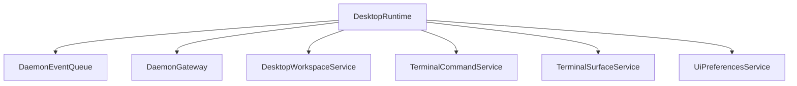
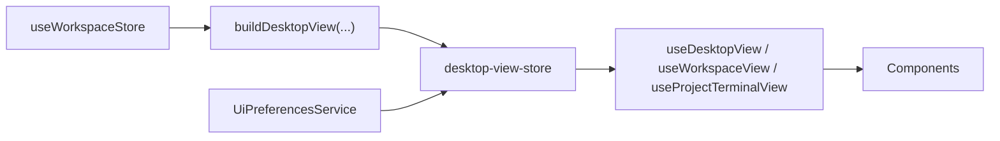
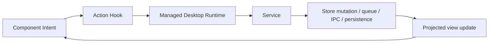

# Desktop Runtime Architecture

This document describes the current desktop runtime architecture in `apps/desktop`.

It is intentionally about the real implementation on disk, not an aspirational rewrite. It also explains the important architectural tradeoffs and the recommended direction from here.

The short version is:

- React now reads through a dedicated desktop read-model layer.
- Most UI commands now go through the managed desktop runtime and service layer.
- `Effect` is used for bootstrapping, orchestration, long-lived services, cancellation, and IPC boundaries.
- the legacy `useWorkspaceStore` still exists underneath as the internal mutation engine for much of the workspace/runtime/layout domain.

So the current architecture is a hybrid:

- better public boundaries
- better command routing
- still not a fully independent Effect-owned domain core

## Principles

- Name modules for what they own, not for the library they use.
- Keep one React read-model adapter path.
- Keep one command path from UI to runtime services.
- Treat `Effect` as an implementation detail of services and bootstrapping, not as the top-level module taxonomy.
- Cache data and resources intentionally, not mounted UI trees.

## Top-Level Layout

Desktop code is organized by role:

- [`src/app/desktop-runtime.ts`](/Users/manik/code/pandora/apps/desktop/src/app/desktop-runtime.ts)
  App-layer runtime composition.
- [`src/services/`](/Users/manik/code/pandora/apps/desktop/src/services)
  Long-lived operational owners.
- [`src/state/`](/Users/manik/code/pandora/apps/desktop/src/state)
  React-facing view projections and adapter store.
- [`src/hooks/`](/Users/manik/code/pandora/apps/desktop/src/hooks)
  React read hooks and command hooks.
- [`src/lib/`](/Users/manik/code/pandora/apps/desktop/src/lib)
  Shared helpers, layout transforms, editor helpers, terminal helpers, and other support code.

## Three Small Graphs

The architecture is easiest to understand by separating service wiring, read flow, and write flow.

### 1. Service Graph



This answers one question only: what long-lived services exist in the runtime?

### 2. Read Flow



This answers: how does state get to React today?

### 3. Write Flow



This answers: how do actions happen?

## Runtime Composition

File: [`src/app/desktop-runtime.ts`](/Users/manik/code/pandora/apps/desktop/src/app/desktop-runtime.ts)

This file composes the managed desktop runtime.

It currently provides:

- `DaemonEventQueueLive`
- `DaemonGatewayLive`
- `DesktopWorkspaceServiceLive`
- `TerminalCommandServiceLive`
- `TerminalSurfaceServiceLive`
- `UiPreferencesServiceLive`

The runtime is exposed through:

- `getDesktopRuntime()`
- `PandoraDesktopRuntime`

This file is the one place that should think in terms of layer wiring.

## Services

## `DesktopWorkspaceService`

File: [`src/services/workspace/desktop-workspace-service.ts`](/Users/manik/code/pandora/apps/desktop/src/services/workspace/desktop-workspace-service.ts)

This is the main app/workspace coordination boundary.

It owns:

- desktop boot-time state loading
- workspace selection
- workspace startup and cancellation
- daemon event ingestion
- workspace session command lookup
- publication of the desktop read model into the React adapter store

It exposes the main desktop command API:

- project/workspace load and selection
- navigation and search state updates
- layout-level commands like `cycleTab` and `addDiffTabForPath`
- project terminal group actions
- workspace session lookup via `getWorkspaceSession(workspaceId)`

### Important implementation details

`DesktopWorkspaceService` is better than the old architecture boundary, but it is not yet an independent domain core.

It still:

- reads from `useWorkspaceStore`
- writes to `useWorkspaceStore`
- republishes projections into [`desktop-view-store.ts`](/Users/manik/code/pandora/apps/desktop/src/state/desktop-view-store.ts)

It also owns startup orchestration with:

- `startWorkspaceRuntimeEffect(...)`
- `loadWorkspaceLayoutEffect(...)`
- a `startupFibersRef` map keyed by workspace id

This is a meaningful improvement over the older rogue `Effect.runFork(...)` pattern because startup fibers now live under the managed service layer instead of being hidden inside store actions.

### Workspace sessions

`getWorkspaceSession(workspaceId)` returns a session-like object with commands such as:

- `focusPane`
- `addTabToPane`
- `removeTab`
- `selectTabInPane`
- `splitPane`
- `moveTab`
- `reorderTab`
- `closeTab`
- `seedTerminal`

Today, these commands are still mostly façades over `useWorkspaceStore` mutations. So the service boundary exists, but the underlying state engine is still the legacy store.

## `DaemonGateway`

File: [`src/services/daemon/daemon-gateway.ts`](/Users/manik/code/pandora/apps/desktop/src/services/daemon/daemon-gateway.ts)

This service owns:

- daemon client lifecycle
- callback registration on the raw transport
- translation of raw daemon callbacks into typed `DaemonEvent`s

It exposes:

- `connect()`
- `disconnect()`
- `getClient()`
- `client: Ref<DaemonClient | null>`

### Important implementation detail

This service no longer mutates the workspace store directly.

Instead, it publishes typed daemon events into [`daemon-event-queue.ts`](/Users/manik/code/pandora/apps/desktop/src/services/daemon/daemon-event-queue.ts).

That is one of the most important architectural improvements in the current codebase because daemon transport is no longer writing straight into the store from callback closures.

## `DaemonEventQueue`

File: [`src/services/daemon/daemon-event-queue.ts`](/Users/manik/code/pandora/apps/desktop/src/services/daemon/daemon-event-queue.ts)

This service owns:

- typed daemon event buffering between transport and state application

It exposes:

- `publish(event)`
- `take()`

Its event types include:

- connection state changes
- slot snapshots and slot lifecycle events
- session snapshots and session lifecycle events
- output chunks
- daemon errors

This queue creates a real handoff boundary between transport and state application.

## `TerminalCommandService`

File: [`src/services/terminal/terminal-command-service.ts`](/Users/manik/code/pandora/apps/desktop/src/services/terminal/terminal-command-service.ts)

This service owns the public terminal command boundary for React.

It handles:

- workspace terminal creation
- project terminal creation
- project terminal splitting
- close terminal slot
- rename terminal
- send input
- close focused tab
- bottom terminal panel open behavior

This is a major improvement over the older architecture because terminal commands are no longer driven by a giant imperative UI hook.

### Important caveat

Even though the command boundary is now correct, the service still uses `useWorkspaceStore` internally for:

- runtime inspection
- layout insertion/removal around terminal tabs
- project terminal panel mutations

So the public path is improved, but the internal terminal domain is not fully detached from the legacy store.

## `TerminalSurfaceService`

File: [`src/services/terminal/terminal-surface-service.ts`](/Users/manik/code/pandora/apps/desktop/src/services/terminal/terminal-surface-service.ts)

This service owns:

- native terminal surface IPC
- web overlay begin/end operations
- surface register/create/update/release calls

This means Tauri terminal surface IPC is now behind one service boundary.

### Important caveat

This service is still primarily an IPC wrapper. It does not yet own a rich in-memory resource graph of surfaces with policy about workspace/session lifetime. React still computes anchors and geometry, then calls the service.

## `UiPreferencesService`

File: [`src/services/preferences/ui-preferences-service.ts`](/Users/manik/code/pandora/apps/desktop/src/services/preferences/ui-preferences-service.ts)

This service owns:

- sidebar visibility persistence
- file tree open-state persistence
- publication of UI preference read models

This is one of the cleanest service boundaries in the current architecture because it is not trying to be a façade over the workspace store in the same way the workspace domain still is.

## State and Read Models

The React read-model layer lives under `src/state`.

## `desktop-view-projections.ts`

File: [`src/state/desktop-view-projections.ts`](/Users/manik/code/pandora/apps/desktop/src/state/desktop-view-projections.ts)

This file defines the React-facing immutable view types:

- `DesktopView`
- `WorkspaceView`
- `ProjectTerminalView`
- `UiPreferencesView`

And it defines projection builders:

- `buildDesktopView(...)`
- `buildWorkspaceView(...)`
- `buildProjectTerminalView(...)`

`DesktopView` currently includes:

- projects/workspaces
- selected project/workspace ids and objects
- runtime map
- active runtime
- connection state
- navigation area
- search text
- layout target runtime id

This projection is currently built from `WorkspaceStoreState`.

## `desktop-view-store.ts`

File: [`src/state/desktop-view-store.ts`](/Users/manik/code/pandora/apps/desktop/src/state/desktop-view-store.ts)

This is a thin Zustand adapter store for React.

It stores only:

- `desktopView`
- `uiPreferences`

and exposes only:

- `setDesktopView(view)`
- `setUiPreferences(view)`

This is not supposed to be a second source of truth. It is a subscription adapter.

## Hooks

Hooks are split by responsibility.

## Bootstrap Hooks

File: [`src/hooks/use-bootstrap-desktop.ts`](/Users/manik/code/pandora/apps/desktop/src/hooks/use-bootstrap-desktop.ts)

Exports:

- `useDesktopRuntime()`
- `useDesktopEffectRunner()`
- `useBootstrapDesktop()`

`useBootstrapDesktop()` performs one-time boot:

1. load desktop state through `DesktopWorkspaceService`
2. hydrate UI preferences through `UiPreferencesService`

`useDesktopEffectRunner()` is the small runtime runner used by action hooks.

## Read Hooks

File: [`src/hooks/use-desktop-view.ts`](/Users/manik/code/pandora/apps/desktop/src/hooks/use-desktop-view.ts)

Exports:

- `useDesktopView()`
- `useWorkspaceView()`
- `useProjectTerminalView()`
- `useUiPreferencesView()`

These all read from `desktop-view-store`.

Important nuance:

- `useWorkspaceView()` and `useProjectTerminalView()` still derive small subviews at hook time from the desktop snapshot
- that is acceptable, but it means React is not directly subscribing to independently published workspace-scoped streams

## Action Hooks

Files:

- [`src/hooks/use-workspace-actions.ts`](/Users/manik/code/pandora/apps/desktop/src/hooks/use-workspace-actions.ts)
- [`src/hooks/use-layout-actions.ts`](/Users/manik/code/pandora/apps/desktop/src/hooks/use-layout-actions.ts)
- [`src/hooks/use-terminal-actions.ts`](/Users/manik/code/pandora/apps/desktop/src/hooks/use-terminal-actions.ts)
- [`src/hooks/use-ui-preferences.ts`](/Users/manik/code/pandora/apps/desktop/src/hooks/use-ui-preferences.ts)

These hooks are the public UI command path.

They run Effects against the managed runtime and route those commands into the service layer.

### `useWorkspaceActions`

Routes:

- load/reload
- project/workspace selection
- navigation state
- archive/pr state
- daemon connect/disconnect

to `DesktopWorkspaceService` and `DaemonGateway`.

### `useLayoutActions`

Routes:

- tab cycling
- split/move/reorder
- focused pane changes
- diff tab creation

through `DesktopWorkspaceService`, then into workspace session commands.

### `useTerminalActions`

Routes:

- new terminal
- close focused tab
- bottom panel toggle
- workspace terminal creation
- terminal input

through `TerminalCommandService`.

This is a much better boundary than the previous direct-store terminal hook pattern.

### `useUiPreferencesActions`

Routes shell preference changes through `UiPreferencesService`.

## Runtime and UI Flow

## Boot Flow

```text
App mount
  -> useBootstrapDesktop()
  -> DesktopWorkspaceService.loadDesktopState()
  -> UiPreferencesService.hydrate()
  -> desktop-view-store gets initial snapshots
  -> React renders shell
```

## Daemon Flow

```text
useDaemonClient()
  -> DaemonGateway.connect()
  -> raw daemon callbacks
  -> DaemonEventQueue.publish(event)
  -> DesktopWorkspaceService consumes events
  -> useWorkspaceStore mutates
  -> buildDesktopView(...)
  -> desktop-view-store.setDesktopView(...)
  -> React updates
```

## Terminal Flow

```text
Component
  -> useTerminalActions()
  -> TerminalCommandService
  -> daemon client / workspace store mutation / IPC
  -> runtime state changes
  -> projected desktop view updates
```

## Layout Flow

```text
Component
  -> useLayoutActions()
  -> DesktopWorkspaceService.getWorkspaceSession(...)
  -> session command
  -> workspace store layout mutation
  -> projected desktop view update
```

## Current Strengths

- the public app/runtime boundaries are much clearer than before
- daemon transport no longer writes straight into the store from raw callbacks
- workspace startup and cancellation are now coordinated inside `DesktopWorkspaceService`
- React reads from one dedicated desktop read-model adapter path
- terminal commands now go through a real service
- surface IPC is behind a dedicated service
- UI preferences are cleanly separated

## Current Weaknesses / Compatibility Seams

These are the main ways the current implementation is still hybrid.

### 1. `useWorkspaceStore` is still the internal state engine

Even though the public architecture surface is now `DesktopWorkspaceService` plus the read-model layer, the underlying domain mutations still mostly happen in `useWorkspaceStore`.

That means:

- the new services are real boundaries
- but they are still façades over the old state engine in many places

### 2. Read-model publication still involves projection mirroring

The main read path today is:

```text
useWorkspaceStore
  -> buildDesktopView(...)
  -> desktop-view-store.setDesktopView(...)
  -> React hooks
  -> components
```

This is workable and simpler than the older multiple-mirror path, but it is still projection fan-out on every store change.

That is acceptable for now, but it means the desktop view layer is still downstream of the store rather than authoritative itself.

### 3. `TerminalCommandService` still mixes command boundary and store-backed mutation logic

This service is a big improvement, but it still does a lot internally:

- store reads
- runtime connection waiting
- terminal tab insertion
- project terminal panel mutation
- close-tab branching

So the boundary is better, but terminal behavior is still tightly coupled to the legacy runtime/layout representation.

### 4. `TerminalSurfaceService` is a policy-light wrapper

It owns surface IPC, but not a true resource registry of:

- active surfaces
- ownership by workspace/session
- cache/eviction policy
- lifecycle policy beyond explicit create/update/release calls

### 5. Workspace session commands are still façade commands

`getWorkspaceSession(...)` gives the UI a cleaner workspace-local interface, but those commands still mostly delegate into the store rather than an independent session-local state container.

## Practical “Who Owns What” Summary

- `desktop-runtime.ts`
  - owns service layer wiring

- `DesktopWorkspaceService`
  - owns desktop coordination, startup/cancellation, daemon event application, and desktop view publication
  - still uses `useWorkspaceStore` internally

- `DaemonGateway`
  - owns daemon transport lifecycle and translation to typed events

- `DaemonEventQueue`
  - owns buffering between transport and workspace state application

- `TerminalCommandService`
  - owns terminal command entry points from React
  - still relies on the store-backed runtime/layout model internally

- `TerminalSurfaceService`
  - owns native terminal IPC
  - does not yet own a higher-level in-memory surface policy graph

- `UiPreferencesService`
  - owns persisted shell/UI preferences

- `desktop-view-store`
  - owns no domain logic
  - only stores projected React-facing snapshots

- `useWorkspaceStore`
  - still owns much of the internal mutation logic and runtime/layout state representation underneath the public service layer

## What “Finished Enough” Would Mean

The architecture does not need to become “full Effect everywhere” to be in a good place.

A strong end state would mean:

1. all UI commands go through the service/action-hook path
2. all daemon event application goes through the workspace coordination layer
3. workspace startup/cancellation remains owned by one managed runtime path
4. terminal surface lifetime is defined by an explicit owner, not hidden mounted UI
5. layout state and mutations live under one clear owner instead of being split across multiple bridges
6. React reads from one stable projected snapshot path

## Recommended Architecture Direction

The right goal is not “make everything Effect-native.”

The better goal is:

- use Effect where lifecycle, cancellation, IPC, and ownership matter
- keep view-model publication simple
- keep one command path
- keep deterministic layout logic pure and testable
- avoid redundant mirrors of the same state

## Recommended Priority Order

If we want to improve the architecture further, the highest-value next steps are:

1. reduce the internal dependency of `TerminalCommandService` on raw store logic
2. strengthen `TerminalSurfaceService` from “IPC wrapper” into a clearer surface ownership boundary
3. keep shrinking the amount of workspace/runtime logic that bypasses `DesktopWorkspaceService`
4. collapse any remaining unnecessary projection/mirroring layers
5. only then decide whether the legacy workspace store should remain the internal engine or be replaced

That ordering matters.

The biggest bugs in this app have come from:

- unclear ownership
- hidden lifecycle coupling
- cached mounted UI trees
- direct cross-cutting imperative paths

not from “not enough Effect.”

## Pragmatic Patterns To Keep

### Keep Effect for:

- managed runtime composition
- startup/cancellation
- daemon transport and event buffering
- terminal command orchestration
- terminal surface IPC/lifecycle boundaries
- UI preference persistence

### Keep pure modules for:

- layout tree transforms
- tab walking
- deterministic editor/layout helpers

### Keep React local state for:

- drag state
- resize state
- hover state
- local presentation toggles with no persistence or ownership impact

## Recommendation

The right target is:

- one clear owner per domain/resource area
- one command path from UI into services
- one React read-model path
- intentional data/resource caching
- no reliance on mounted hidden UI as an ownership mechanism

In one sentence:

use Effect where the app has real time, ownership, and external-resource problems, and use simpler patterns everywhere else.

## File Map

- Runtime:
  - [`src/app/desktop-runtime.ts`](/Users/manik/code/pandora/apps/desktop/src/app/desktop-runtime.ts)

- Services:
  - [`src/services/workspace/desktop-workspace-service.ts`](/Users/manik/code/pandora/apps/desktop/src/services/workspace/desktop-workspace-service.ts)
  - [`src/services/daemon/daemon-gateway.ts`](/Users/manik/code/pandora/apps/desktop/src/services/daemon/daemon-gateway.ts)
  - [`src/services/daemon/daemon-event-queue.ts`](/Users/manik/code/pandora/apps/desktop/src/services/daemon/daemon-event-queue.ts)
  - [`src/services/terminal/terminal-command-service.ts`](/Users/manik/code/pandora/apps/desktop/src/services/terminal/terminal-command-service.ts)
  - [`src/services/terminal/terminal-surface-service.ts`](/Users/manik/code/pandora/apps/desktop/src/services/terminal/terminal-surface-service.ts)
  - [`src/services/preferences/ui-preferences-service.ts`](/Users/manik/code/pandora/apps/desktop/src/services/preferences/ui-preferences-service.ts)

- State:
  - [`src/state/desktop-view-projections.ts`](/Users/manik/code/pandora/apps/desktop/src/state/desktop-view-projections.ts)
  - [`src/state/desktop-view-store.ts`](/Users/manik/code/pandora/apps/desktop/src/state/desktop-view-store.ts)

- Hooks:
  - [`src/hooks/use-bootstrap-desktop.ts`](/Users/manik/code/pandora/apps/desktop/src/hooks/use-bootstrap-desktop.ts)
  - [`src/hooks/use-desktop-view.ts`](/Users/manik/code/pandora/apps/desktop/src/hooks/use-desktop-view.ts)
  - [`src/hooks/use-workspace-actions.ts`](/Users/manik/code/pandora/apps/desktop/src/hooks/use-workspace-actions.ts)
  - [`src/hooks/use-layout-actions.ts`](/Users/manik/code/pandora/apps/desktop/src/hooks/use-layout-actions.ts)
  - [`src/hooks/use-terminal-actions.ts`](/Users/manik/code/pandora/apps/desktop/src/hooks/use-terminal-actions.ts)
  - [`src/hooks/use-ui-preferences.ts`](/Users/manik/code/pandora/apps/desktop/src/hooks/use-ui-preferences.ts)

- Legacy internal engine:
  - [`src/stores/workspace-store.ts`](/Users/manik/code/pandora/apps/desktop/src/stores/workspace-store.ts)
