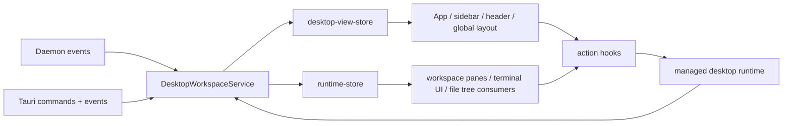

# New Desktop Architecture

This document explains the architectural changes that landed after the original
[`effect-architecture.md`](./effect-architecture.md) writeup.

It is not a full replacement for that document. Instead, it explains what
changed in the desktop app, why those changes were made, and what the new
runtime/read-model boundaries are now.

## Why We Changed It

Three problems were dominating the app:

- high-churn daemon/runtime events were invalidating large parts of React
- workspace selection and creation were visually blocked on async settle work
- loading states were owned by wrappers instead of the actual UI regions

The result was a desktop app that looked optimistic in a few places, but still
behaved like a synchronous application under load.

The new architecture keeps the existing Effect-based service layer, but changes
where churn lives and when UI state is allowed to update.

## High-Level Shape

The desktop app now has a clearer split between:

- low-churn app selection/navigation data
- high-churn runtime/session/slot data
- async settle work that follows selection instead of defining selection

At a high level:

The key shift is that the main desktop view is no longer the carrier for runtime
churn.

## 1. Read Model Split

### Before

`DesktopView` contained both:

- project/workspace/navigation state
- runtime state

That meant every slot/session/output mutation could force subscribers that only
cared about:

- selected workspace
- sidebar rows
- app header
- global layout chrome

to re-render anyway.

### Now

The read side is split into two stores:

- [`src/state/desktop-view-store.ts`](../src/state/desktop-view-store.ts)
- [`src/state/runtime-store.ts`](../src/state/runtime-store.ts)

`desktop-view-store` now owns only low-churn UI-facing state:

- projects
- workspaces
- selected project/workspace
- navigation area
- search text
- layout target runtime id
- UI preferences

`runtime-store` owns the runtime map:

- workspace runtime state
- project runtime state
- slots
- sessions
- terminal display state
- connection/layout state

That split is reflected in:

- [`src/state/desktop-view-projections.ts`](../src/state/desktop-view-projections.ts)
- [`src/hooks/use-desktop-view.ts`](../src/hooks/use-desktop-view.ts)

React now reads:

- `useDesktopView(...)` for low-churn desktop state
- `useRuntimeState(runtimeId)` for runtime state

This is the single most important architectural performance change because it
stops terminal/session churn from invalidating unrelated desktop chrome.

## 2. Publish Split Inside `DesktopWorkspaceService`

The core service still owns the in-memory snapshot, but it now publishes into
two channels instead of one:

- `publishDesktopNow()` / `scheduleDesktopPublish()`
- `publishRuntimeNow()` / `scheduleRuntimePublish()`

Inside
[`src/services/workspace/desktop-workspace-service.ts`](../src/services/workspace/desktop-workspace-service.ts),
desktop and runtime publishes are coalesced independently with microtasks.

That changes the update shape from:

1. daemon event arrives
2. rebuild full desktop view
3. publish whole React snapshot

to:

1. daemon event arrives
2. mutate the relevant snapshot section
3. schedule only the desktop publish, runtime publish, or both

Two important consequences:

- no-op terminal output no longer forces a desktop publish
- multiple daemon events in the same turn collapse into one publish per store

## 3. Selection Is Immediate, Settle Is Background Work

### The old problem

Selection had started drifting toward an awkward model where the app would:

- change selection
- start async settle work
- try to ignore stale completions later with generation checks

That made rapid keyboard navigation fragile because selection and settle work
were still too entangled.

### The new model

Selection is now treated as a local synchronous state transition:

- selected project/workspace is updated immediately in the desktop snapshot
- the desktop view is published immediately
- persistence side effects like `save_selection` happen after local selection is applied
- runtime/layout startup follows in a cancellable background fiber

The service now tracks:

- `selectionTargetWorkspaceID`
- `selectionSettleFiber`

instead of relying on the old lazy-import plus generation-guard pattern.

This means the user-visible truth is:

1. the sidebar highlight moves immediately
2. the workspace shell becomes active immediately
3. runtime/layout startup settles afterward

That is a much better architectural boundary because selection is now owned by
the local domain snapshot, not by async completion timing.

## 4. Relative Workspace Navigation Uses the Requested Cursor

Rapid `Cmd+Opt+Arrow` navigation exposed another architectural flaw: relative
navigation was deriving "next workspace" from mutable selected state that could
lag behind repeated user input.

The new selection model uses `selectionTargetWorkspaceID` as the navigation
cursor for repeated relative navigation. In practice that means:

- repeated navigation walks from the latest requested workspace
- not from whichever async settle finished last

Additionally,
[`src/hooks/use-keyboard-shortcuts.ts`](../src/hooks/use-keyboard-shortcuts.ts)
now dedupes the workspace shortcut path so the same physical shortcut cannot be
handled twice in quick succession by both:

- DOM `keydown`
- native `app-shortcut`

This is still a UI-layer fix, not a Rust-side responsibility. Rust emits the
shortcut event when native terminal focus intercepts the key path, but the
selection model itself belongs in the frontend service layer.

## 5. Workspace Creation and Retry Are Event-Driven

The Tauri backend used to block the command response on worktree creation.

That meant "create workspace" behaved like:

1. ask Rust to create it
2. wait for blocking git worktree work
3. finally return a record
4. then reload all app state

That defeated optimistic UI.

### New backend flow

In
[`src-tauri/src/commands.rs`](../src-tauri/src/commands.rs):

- `create_workspace` returns the optimistic record immediately
- `retry_workspace` returns the updated `creating` record immediately
- worktree operations continue in background `tokio::spawn(...)`
- completion emits `workspace_record_changed`

### New frontend flow

In `DesktopWorkspaceService`:

- the optimistic record is patched into the workspace list immediately
- the new workspace is selected immediately
- the project is expanded immediately
- later `workspace_record_changed` events patch the record in place

The frontend no longer needs to call `load_app_state()` after every create/retry.

Architecturally, this moves workspace creation from:

- command-return-as-truth

to:

- local optimistic truth
- backend reconciliation by event

That is much closer to the rest of the daemon/event-driven model.

## 6. Ordering Is Stable and Intentional

Projects and workspaces are now ordered by `createdAt DESC` on the frontend
projection side.

That matters because "new thing should appear at the top" is part of the UI
model, not just a rendering detail.

We intentionally stopped using `updatedAt` for list ordering because fields like
`mark_workspace_opened` mutate `updatedAt`, which can reorder the list while the
user is navigating. That kind of reorder made relative workspace navigation feel
random even when selection logic was otherwise correct.

So the architecture now treats:

- `createdAt` as ordering identity
- `updatedAt` as mutation metadata

Those are different responsibilities and should not be conflated.

## 7. Loaders Are Region-Owned, Not Wrapper-Owned

The loading model also changed materially.

### Before

The app could render a blank shell or allow inner regions to fall through to
their empty state before runtime/layout settle had actually finished.

Examples:

- empty sidebar during boot
- missing header during boot
- "No terminals" while a terminal surface was still starting
- empty workspace state while a workspace runtime was still connecting/loading

### Now

The app frame stays mounted earlier, and each region owns its own loading UI:

- app header
- left sidebar
- workspace surface
- right sidebar
- SCM panel
- bottom terminal panel

The rule is:

- global layout should stay visible
- region content should show a local loader until its own data is actually ready

This is visible in:

- [`src/App.tsx`](../src/App.tsx)
- [`src/components/layout/app-header.tsx`](../src/components/layout/app-header.tsx)
- [`src/components/layout/left-sidebar/left-sidebar.tsx`](../src/components/layout/left-sidebar/left-sidebar.tsx)
- [`src/components/layout/workspace/workspace-view.tsx`](../src/components/layout/workspace/workspace-view.tsx)

### Important workspace loading rule

`WorkspaceView` now treats all of these as loading:

- `runtime == null`
- `connectionState !== "connected"`
- `layoutLoading`
- `!layoutLoaded`

Only after those settle do we allow the true empty state like "No open tabs".

This is an architectural improvement because empty state now means "there is
truly no content", not "the runtime has not caught up yet".

## 8. App-Level React Subscriptions Are Narrower

The app root used to subscribe to broad desktop/UI objects and re-render far too
easily.

[`src/App.tsx`](../src/App.tsx) now subscribes to narrower selectors like:

- selected workspace id
- selected workspace status
- selected project
- sidebar visibility
- file tree visibility
- hydration flags

This is not a new domain boundary by itself, but it is an important consequence
of the new read-model split:

- React root subscribes only to what it actually needs
- runtime-heavy regions subscribe to runtime store directly

## 9. Sidebar/SCM Work Only Runs When Visible

The right sidebar is still not fully virtualized, but the architecture is better
than before because expensive polling is now visibility-aware.

In
[`src/components/layout/right-sidebar/scm/scm-queries.ts`](../src/components/layout/right-sidebar/scm/scm-queries.ts):

- SCM queries accept `enabled`
- they use `staleTime`
- they use `gcTime`

That means the sidebar is no longer architecturally modeled as "always hot even
when hidden". Visibility now matters to query ownership.

## 10. What Did Not Change

The new architecture is better, but it is still intentionally incremental.

These things are still true:

- `DesktopWorkspaceService` still owns a mutable in-memory snapshot
- runtime updates still publish the whole runtime map, not per-workspace streams
- workspace/runtime domain logic is still centered in one large service
- file tree virtualization has not been introduced yet
- terminal surface ownership still depends on React-driven anchor geometry

So this is not a full rewrite into a pure domain/event-sourced system.

It is a practical restructuring around the hottest paths:

- publish churn
- optimistic selection
- optimistic creation
- loading ownership

## Summary

The architecture changed in one important way:

the app no longer waits for expensive work to decide what the user is looking at.

Instead:

- selection is immediate
- creation is optimistic
- reconciliation is event-driven
- runtime churn is isolated from global desktop chrome
- loading UI is local to the region that is still settling

That is the real new architecture.
